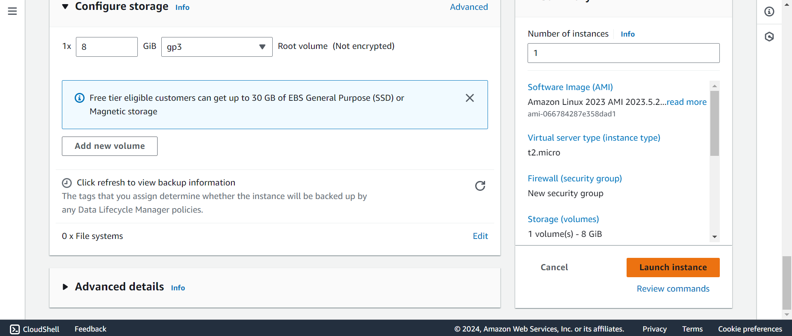

# How to launch an EC2 free instance.
1. Give an instance name

2. Select the OS by selecting AMI - Amazon Machine Image

3. Select the Instance Type and Keypair

4. Create the keypair and save it

5. Save the key pair

6. Create the security group and allow the SSH, HTTPS and HTTP traffic.

7. Launch the instance

